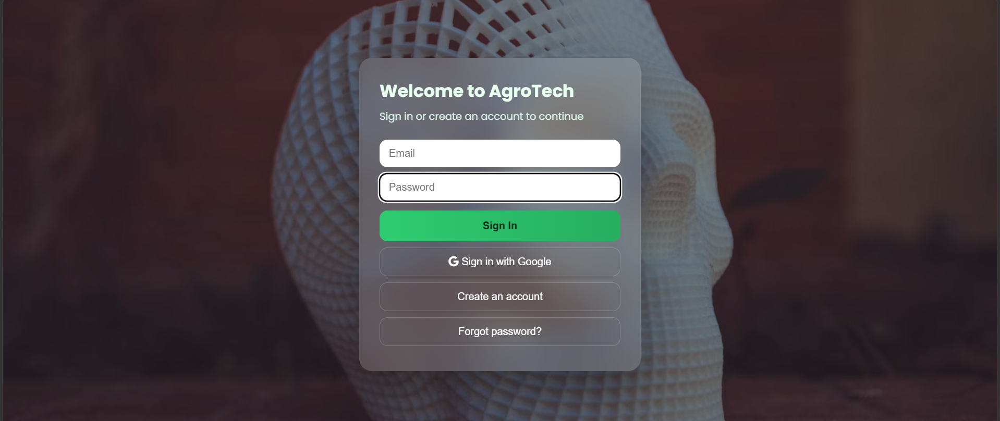
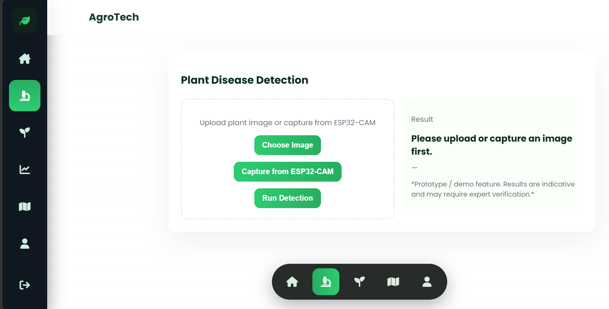
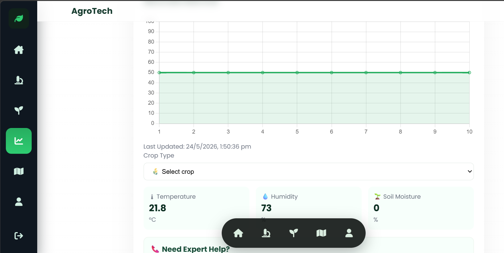
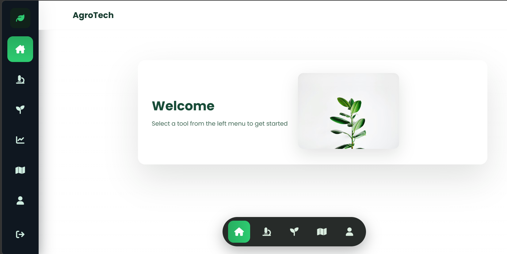

## 🌱 AgroTech — Smart Farming Dashboard

> 🚀 A Smart Agriculture System combining IoT + Web App + Android APK to improve crop monitoring, disease detection, and farm decision-making.

---

## 📌 Overview

AgroTech is a full-stack smart farming solution that integrates:

* 🌐 Web Application
* 📱 Android Application (APK via Android Studio)
* 📡 IoT Sensors (ESP32 + Soil, Temp, Humidity)
* 📷 ESP32-CAM (Live Field Monitoring)

This system enables farmers to **monitor crops in real-time, detect issues early, and make data-driven decisions.

---
## 🧩 Project Structure
```
AGROTECH-V1/
├── .firebaserc
├── README.md
├── firebase.json
├── data/   
│   ├── 404.html
│   ├── andriod-chrome-192X192.png
│   └── andriod-chrome-512X195.png
│   └── apple-touch-icon.png
│   └── demo.html
│   └── favicon-16X16.png
│   └── favicon-32X32.png
│   └── favicon.ico
│   └── index.html
│   └── LICENSE
│   └── README.md
│   └── SECURITY.md
│   └── site.webmanifest
├── .gitignore
├── Agrotech app Password.png
├── Preview-1.png
├── Preview-2.png
├── Preview-3.png
├── Preview-4.png
```
---
## 🔥 Key Features

### 🌿 Plant Disease Detection

* Upload image OR capture via ESP32-CAM
* Detects plant conditions
* Shows treatment suggestions
* ❌ Displays “No Plant Detected” for invalid images

---

### 📷 ESP32-CAM Integration

* Real-time image capture
* Works on local WiFi network
* Integrated directly with detection system

---

### 💧 Smart Moisture Monitoring

* Displays:

  * 🌡 Temperature
  * 💧 Humidity
  * 🌱 Soil Moisture
* 📊 Live charts using Chart.js
* 📡 Firebase Realtime Database integration
* 🧠 Crop-based recommendations

---

### 🌱 Seed Requirement Calculator

* Calculates:

  * Number of seeds
  * Required weight
* Supports multiple crops
* Custom input supported

---

### 🧠 Field Analysis System

* Crop + Soil based analysis
* Detects:
  * Water stress
  * Soil mismatch
  * Risk level
* Provides practical farming recommendations

---

### 🔐 Authentication System

* Firebase Authentication
* Email & Password login
* Google Sign-In support

---

### 📱 Android Application (APK)

AgroTech is also deployed as a native Android application using Android Studio.

---

## ⚙️ Architecture

* Uses WebView technology
* Loads the AgroTech web app inside mobile app
* Fully supports:

  * Firebase authentication
  * Real-time sensor data
  * ESP32-CAM image capture


## 🛠️ Android Studio Setup

 Requirements

* Android Studio
* Android SDK
* Java (JDK)

---
## Preview of front page 
<p align="center">
  
</p>

---

## Preview
<p align="center">
  
</p>
<p align="center">
  
</p>
<p align="center">
  
</p>
---

## Implementation Steps

1. Create new project (Empty Activity)
2. Add WebView in `MainActivity.java`
3. Enable JavaScript
4. Load web app URL
5. Add internet permission

---

## 💻 WebView Code

```java id="code1"
WebView webView = new WebView(this);
setContentView(webView);

webView.getSettings().setJavaScriptEnabled(true);
webView.setWebViewClient(new WebViewClient());

webView.loadUrl("https://your-website-link.com");
```
---

## 🔐 Required Permission

```xml id="code2"
<uses-permission android:name="android.permission.INTERNET"/>
```
---

## 📦 APK Generation

* Build → Generate Signed Bundle / APK
* Output:

```
app-release.apk
```
---


## 🛠️ Technologies Used

| Category   | Technology Used               |
| ---------- | ----------------------------- |
| Frontend   | HTML, CSS, JavaScript         |
| Backend    | Firebase (Auth + Realtime DB) |
| IoT        | ESP32 + Sensors               |
| Camera     | ESP32-CAM                     |
| Charts     | Chart.js                      |
| Mobile App | Android Studio (WebView)      |

---

## ⚙️ System Workflow

```
ESP32 Sensors → Firebase → Web App → Android App
```

1. Sensors collect real-time data
2. ESP32 sends data to Firebase
3. Web app fetches & displays data
4. Android app loads same system
5. User receives insights & recommendations
---


## 📡 IoT Integration

* Soil Moisture
* Temperature
* Humidity

Data path:

```
/agrotech/sensors
```
---

### 💻 Local Development

1. **Clone the repository:**
   ```bash
   # Using Git
   git clone https://github.com/Ratnadip143/Agrotech-v1
   
   # Or use GitHub Desktop for GUI cloning
   ```

2. **Navigate to project directory:**
   ```bash
   cd AGROTECH-V1
   ```
3. **Open the main website:**
   - Simply open `index.html` in your browser
   - Or use a local server (recommended):
   ```bash
   # Using Python
   python -m http.server 8000

   # Using VS Code Live Server extension
   ```

4. **For individual projects:**
   - Open the project's `index.html` file

---

### 🐛 Bug Fixes & Improvements
1. **Fork** the repository
2. **Create** a new branch: `git checkout -b fix-bug-name`
3. **Make** your changes
4. **Test** thoroughly
5. **Submit** a pull request

---

## Contribution
Contributions are welcome.
- Fork the repository
- Create a new branch
- Commit changes
- Open a Pull Request

---

### 📋 Contribution Guidelines
- Follow existing code style and structure
- Add appropriate comments to your code  
- Test your changes before submitting
- Include a clear commit message
- Update documentation if needed

---

## ⚠️ Important Notes
* ⚠️ This is a prototype system
* 🤖 AI detection is currently simulated
* 📶 ESP32 must be on same WiFi network
* 📱 APK uses WebView architecture
---


## 🔮 Future Scope
* Real AI model integration (TensorFlow)
* Native Android UI
* Offline mode for rural areas
* Automated irrigation system
* Cloud-based analytics
---

## 👨‍💻 Author

Ratnadip Roy

---

## 📄 License

This project is for educational and research purposes only.

---

## ⭐ Final Note
AgroTech demonstrates how IoT + Web + Mobile + AI can be combined to build a smart farming ecosystem.

---
# TEST CHANGE Wed Jun  3 00:07:44 IST 2026
