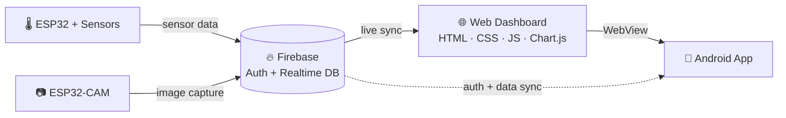

<div align="center">


<br>

[](https://agrotech-v1-r4jps58oe-ratnadip.vercel.app/)
[](public/LICENSE)
[]()
[](https://github.com/Ratnadip143)

<br>


<i>Real-time crop monitoring, plant-disease detection & farm decision-support —<br>
fused from <b>ESP32 sensors</b>, a <b>Firebase-powered web dashboard</b>, and a <b>WebView Android app</b>.</i>

</div>

<br>

<p align="center">
  
  &nbsp;
  
</p>

<br>

## 📖 Table of Contents

<table>
<tr>
<td valign="top">

- [✨ Overview](#-overview)
- [📸 Screenshots](#-screenshots)
- [🔥 Key Features](#-key-features)
- [⚙️ System Architecture](#️-system-architecture)

</td>
<td valign="top">

- [🛠️ Tech Stack](#️-tech-stack)
- [📂 Project Structure](#-project-structure)
- [🚀 Getting Started](#-getting-started)
- [📡 IoT Data Flow](#-iot-data-flow)

</td>
<td valign="top">

- [⚠️ Important Notes](#️-important-notes)
- [🔮 Roadmap](#-roadmap--future-scope)
- [🤝 Contributing](#-contributing)
- [📄 License & Author](#-license)

</td>
</tr>
</table>

<br>

## ✨ Overview

**AgroTech** is a full-stack smart-farming solution built to help farmers
**monitor crops in real time, catch plant disease early, and make data-driven
decisions** — all from one unified dashboard on web *and* mobile.

<table>
<tr>
<td width="25%" align="center">🌐<br><b>Web App</b><br><sub>Responsive dashboard for monitoring, detection & analysis</sub></td>
<td width="25%" align="center">📱<br><b>Android App</b><br><sub>Native APK (WebView) for on-the-go access</sub></td>
<td width="25%" align="center">📡<br><b>IoT Sensors</b><br><sub>ESP32 + soil, temperature & humidity sensors</sub></td>
<td width="25%" align="center">📷<br><b>ESP32-CAM</b><br><sub>Live field image capture for disease detection</sub></td>
</tr>
</table>

> ⚠️ **Prototype notice:** This project is for learning & demonstration. AI-based
> disease detection is currently simulated, not a production-grade model.

<br>

## 📸 Screenshots

<table>
<tr>
<td align="center" width="50%">

**🔐 Login / Welcome**


</td>
<td align="center" width="50%">

**🏠 Dashboard Home**


</td>
</tr>
<tr>
<td align="center" width="50%">

**🌿 Plant Disease Detection**


</td>
<td align="center" width="50%">

**📊 Live Sensor Monitoring**


</td>
</tr>
</table>

<p align="center">
<a href="https://agrotech-v1-r4jps58oe-ratnadip.vercel.app/"><b>🌍 Try the live app →</b></a>
</p>

<br>

## 🔥 Key Features

<details open>
<summary><b>🌿 Plant Disease Detection</b></summary>
<br>

- Upload a plant image **or** capture one live from the ESP32-CAM
- Runs a (currently simulated) detection model on the image
- Displays the predicted condition + treatment suggestions
- Gracefully shows **"No Plant Detected"** for invalid images

</details>

<details>
<summary><b>📷 ESP32-CAM Integration</b></summary>
<br>

- Real-time image capture over the local Wi-Fi network
- Feeds directly into the disease detection pipeline
- No extra external camera hardware required

</details>

<details>
<summary><b>💧 Smart Moisture & Climate Monitoring</b></summary>
<br>

- Live readouts for 🌡️ **Temperature**, 💧 **Humidity**, 🌱 **Soil Moisture**
- Interactive, live-updating charts powered by **Chart.js**
- Backed by **Firebase Realtime Database** for instant sync across devices
- Crop-aware recommendations based on live sensor values

</details>

<details>
<summary><b>🌱 Seed Requirement Calculator</b></summary>
<br>

- Calculates the **number of seeds** and **total seed weight** required
- Supports multiple common crop types out of the box
- Allows fully custom input for crops outside the default list

</details>

<details>
<summary><b>🧠 Field Analysis System</b></summary>
<br>

- Cross-references **crop type** with **soil conditions**
- Flags 💦 water stress, 🪨 soil mismatch, and overall ⚠️ risk level
- Returns clear, practical recommendations a farmer can act on immediately

</details>

<details>
<summary><b>🔐 Authentication System</b></summary>
<br>

- Firebase Authentication with email & password
- One-tap **Google Sign-In**
- Built-in account creation and password recovery

</details>

<details>
<summary><b>📱 Android Application (APK)</b></summary>
<br>

- Packaged as a native Android app via a lightweight WebView wrapper
- Same login, sensors, and detection features — one codebase, two platforms

</details>

<br>

## ⚙️ System Architecture



- The **web app** loads inside the Android app via `WebView`
- Both share the same Firebase backend, so **data and auth stay in sync**
- The ESP32 pushes sensor data straight to Firebase; the dashboard listens live

<br>

## 🛠️ Tech Stack

| Category | Technology |
|---|---|
| 🎨 **Frontend** | HTML5, CSS3, JavaScript |
| 🔥 **Backend / Database** | Firebase (Authentication + Realtime Database) |
| ☁️ **Hosting** | Firebase Hosting / Vercel |
| 📡 **IoT Hardware** | ESP32 + Soil Moisture, Temperature & Humidity sensors |
| 📷 **Camera** | ESP32-CAM module |
| 📊 **Charts** | Chart.js |
| 📱 **Mobile App** | Android Studio (Java, WebView) |

<br>

## 📂 Project Structure

```
AGROTECH-V1/
├── README.md
├── banner.svg
├── firebase.json
├── public/
│   ├── index.html              # Main web app
│   ├── demo.html                # Demo / preview page
│   ├── 404.html
│   ├── LICENSE
│   ├── SECURITY.md
│   ├── README.md
│   ├── site.webmanifest
│   ├── favicon.ico
│   ├── favicon-16x16.png
│   ├── favicon-32x32.png
│   ├── apple-touch-icon.png
│   ├── android-chrome-192x192.png
│   └── android-chrome-512x512.png
├── Preview-1.png                # Screenshots used in this README
├── Preview-2.png
├── Preview-3.png
└── Preview-4.png
```

<br>

## 🚀 Getting Started

### 1️⃣ Web App Setup

```bash
# Clone the repository
git clone https://github.com/Ratnadip143/Agrotech-v1.git
cd Agrotech-v1

# Open the main app directly...
open public/index.html

# ...or serve it locally (recommended)
python -m http.server 8000
# then visit http://localhost:8000/public/
```

> 💡 VS Code users can also use the **Live Server** extension for instant reloads.

<details>
<summary><b>2️⃣ Firebase Setup</b></summary>
<br>

AgroTech relies on Firebase for authentication and real-time sensor data.

1. Create a project at the [Firebase Console](https://console.firebase.google.com/)
2. Enable:
   - **Authentication** → Email/Password + Google Sign-In
   - **Realtime Database**
3. Copy your Firebase config snippet into the app's config section in `public/index.html`
4. Deploy hosting (optional):
   ```bash
   firebase login
   firebase init hosting
   firebase deploy
   ```

</details>

<details>
<summary><b>3️⃣ ESP32 / IoT Setup</b></summary>
<br>

**Hardware required:**
- ESP32 development board
- ESP32-CAM module
- Soil moisture sensor
- DHT11 / DHT22 (temperature & humidity)

**Steps:**
1. Flash the ESP32 with firmware that reads sensor values and pushes them to Firebase at:
   ```
   /agrotech/sensors
   ```
2. Connect the ESP32 and ESP32-CAM to the **same Wi-Fi network** as your dashboard device
3. The dashboard automatically picks up new readings via Firebase's real-time listeners

</details>

<details>
<summary><b>4️⃣ Android App Setup</b></summary>
<br>

**Requirements:** Android Studio · Android SDK · Java (JDK)

**Implementation steps:**
1. Create a new project → **Empty Activity**
2. Add a `WebView` in `MainActivity.java`, enable JavaScript, and load the web app URL:

```java
WebView webView = new WebView(this);
setContentView(webView);

webView.getSettings().setJavaScriptEnabled(true);
webView.setWebViewClient(new WebViewClient());

webView.loadUrl("https://your-website-link.com");
```

3. Add the required permission in `AndroidManifest.xml`:

```xml
<uses-permission android:name="android.permission.INTERNET"/>
```

4. Build the release APK: **Build → Generate Signed Bundle / APK** → outputs `app-release.apk`

</details>

<br>

## 📡 IoT Data Flow

```
ESP32 Sensors  →  Firebase Realtime DB  →  Web Dashboard  →  Android App
```

1. Sensors collect live soil, temperature & humidity data
2. ESP32 pushes readings to Firebase under `/agrotech/sensors`
3. The web dashboard listens for changes and updates charts instantly
4. The Android app (same WebView) reflects the identical live data
5. The farmer receives insights, alerts, and crop-specific recommendations

<br>

## ⚠️ Important Notes

| | |
|---|---|
| 🧪 | This is a **prototype system** built for learning and demonstration purposes |
| 🤖 | AI-based disease detection is **currently simulated**, not a production model |
| 📶 | The ESP32 / ESP32-CAM **must be on the same Wi-Fi network** as the dashboard's access point |
| 📱 | The Android app uses a **WebView architecture**, not a fully native UI |

<br>

## 🔮 Roadmap / Future Scope

- [ ] Real AI/ML model integration (TensorFlow) for genuine disease detection
- [ ] Fully native Android UI (move beyond WebView)
- [ ] Offline-first mode for low-connectivity rural areas
- [ ] Automated irrigation triggered directly from sensor thresholds
- [ ] Cloud-based historical analytics & yield prediction
- [ ] Multi-language support for regional accessibility

<br>

## 🤝 Contributing

Contributions, bug reports, and feature ideas are very welcome!

1. **Fork** the repository
2. **Create** a new branch — `git checkout -b fix-bug-name`
3. **Make** your changes & **test** thoroughly
4. **Commit** with a clear message
5. **Open** a Pull Request

<sub>Please follow the existing code style, comment non-obvious logic, and update docs when behavior changes.</sub>

<br>

## 🔐 Security

Found a vulnerability? Please see [`SECURITY.md`](public/SECURITY.md) for supported
versions and reporting guidelines. Responsible disclosure is appreciated.

<br>

## 📄 License

This project is licensed under the **MIT License** — see [`LICENSE`](public/LICENSE) for details.
<br><sub>Educational and research use is the primary intent of this project.</sub>

<br>

## 👨‍💻 Author

<table>
<tr>
<td>

**Ratnadip Roy**
🔗 [GitHub](https://github.com/Ratnadip143) · 🌐 [Live Demo](https://agrotech-v1-r4jps58oe-ratnadip.vercel.app/)

</td>
</tr>
</table>

<br>

<div align="center">

### ⭐ Final Note

AgroTech demonstrates how **IoT + Web + Mobile + AI** can be combined into a
single, cohesive smart-farming ecosystem — built to make agriculture a little
smarter, one sensor reading at a time.

**If you found this project useful, consider giving it a ⭐ on GitHub!**

</div>
